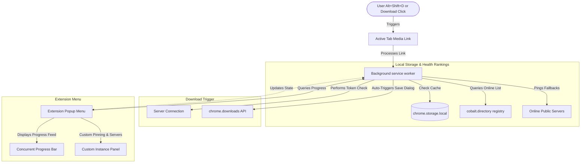

# 🌌 Cobalt Web Downloader Companion

**Cobalt Web Downloader Companion** is a lightweight, high-performance browser extension that enhances your media downloading experience. 

> [!NOTE]
> **Clarification:** This extension is a third-party helper tool that connects directly to the Cobalt ecosystem. It does not run, host, or belong to the official Cobalt project itself. Instead, it plugs right into your browser to make using the public Cobalt APIs as seamless and automated as possible.
>
> You can visit the official web tool and find the original project resources at **[cobalt.tools](https://cobalt.tools)**!

---

## ✨ Why the Cobalt Platform is Amazing

Before jumping in, it's worth noting the core features of **cobalt.tools** that make it so popular in the first place:
*   **🚫 Zero Advertisements or Pop-ups:** Unlike sketchy download sites, Cobalt contains absolutely no tracking, no redirects, and no malicious ads. It is pure, direct, and safe.
*   **⚡ Native Stream Extraction:** It grabs the direct media files straight from the hosting platform's CDN (content delivery network) so you get maximum transfer rates.
*   **🔒 Complete Privacy:** No user accounts, no cookie-trackers, and no telemetry logs are saved. Your media extraction remains fully yours.
*   **🛠️ Extremely Versatile:** Automatically parses raw streams, audio tracks, and gallery sets without requiring external dependencies or system codecs.

---

## 🤔 What Does This Extension Do?

Usually, to use Cobalt, you have to find a working website, copy a link, paste it, wait, and manually click download. 

This companion extension cuts out all the middle steps:
1. **Auto-detects Links:** It instantly detects if you are on a supported video or audio page (like YouTube, TikTok, or Twitter) and fills in the URL for you.
2. **Natively Downloads:** It routes the download directly through your browser's built-in download manager. No weird background tabs flickering, no pop-up advertisements, and no redirect loops.
3. **Alt+Shift+D Global Hotkey:** You don't even need to open the extension menu! Just press `Alt+Shift+D` on any video, and the browser will start downloading it in the background immediately.
4. **🎨 Native Inline Save Buttons:** Spawns a beautifully integrated "Save" or "Download" button directly into the native UI of **TikTok**, **YouTube**, and **Twitter/X** (with **Instagram Coming Soon!**). It blends in perfectly with the active website theme (light/dark) and shows real-time loading spinners and success/error indicators right on the page!

---

## 🌍 How Instances Work

Cobalt is decentralized, meaning it is hosted by generous volunteers all over the world. These servers are called **instances**. 

Instead of relying on a single website that could go down at any moment, this extension uses a smart, resilient multi-server architecture:
*   **Automatic Server Discovery:** Every time the extension starts, it queries **cobalt.directory**—the central public registry where all active Cobalt servers register themselves.
*   **Smart Speed Tests (Pinging):** The extension pings these public servers in the background to find out which ones are online, secure (HTTPS), and responding the fastest to your location.
*   **Automatic Failover (Smart Fallback):** If your selected server is slow, times out, or asks for a security check (Turnstile), the extension immediately and silently switches your request to the next fastest server on the list.
*   **Custom & Private Servers:** If you host your own private Cobalt server or have a favorite public one, you can paste its link in the **Instances** tab to pin it as your number-one priority.

> [!IMPORTANT]
> **🔐 Cloudflare Turnstile & On-Demand Tabs:**
> Because many Cobalt servers use Cloudflare Turnstile to prevent bot spam, the extension must occasionally perform a secure handshake to get an auth token. Since modern browsers heavily throttle hidden background windows, **a temporary background tab will open every once in a while to automatically solve the Turnstile challenge and close itself.**
> 
> To make this as unobtrusive as possible, **we have optimized this process to be strictly on-demand**:
> * The extension **never** opens background tabs randomly on a timer or while you are idle.
> * A Turnstile solver tab will **only** open at the exact moment you explicitly click a "Save" or "Download" button, and **only** if your selected Cobalt server requires active authentication.
> * Once solved, the session is cached and subsequent downloads are instant. If you prefer to never see Turnstile tabs, you can select or add an instance that does not require a sitekey/authentication.

---

## 🚀 Key Features

*   **🎨 Native Inline Save Buttons:** Fully integrated, native-looking "Save" / "Download" buttons injected directly into the layout of major supported sites (TikTok, YouTube, and Twitter/X, with Instagram Coming Soon!) with dynamic hover, loading, success, and error feedback states.
*   **⚡ Multiple Downloads at Once:** Start as many downloads as you want. Each one shows up in a list in the extension with its own progress spinner.
*   **🎵 Audio-Only & Video Quality Selectors:** Easily switch between capturing full-quality video (up to 4K/8K) or extracting just the audio stream into MP3, WAV, or Opus files.
*   **🔄 Instant Tab Sync:** The link box updates in real-time as you switch browser tabs, so it's always ready to grab what you're actively watching.
*   **📂 Custom Naming Styles:** Clean up weird website titles with pretty naming configurations.

---

## 📐 System Architecture

Here is a visual map of how the extension companion coordinates downloads under the hood:

---

## 🛠️ Quick Installation Guide

1.  **Download the Extension:**
    *   Download or clone this repository to your computer.
2.  **Open Extensions page in Chrome/Edge/Brave:**
    *   Type `chrome://extensions/` in your browser URL bar.
3.  **Turn on Developer Mode:**
    *   Click the **Developer mode** toggle in the top-right corner.
4.  **Load the Folder:**
    *   Click **Load unpacked** in the top-left.
    *   Select the **`src/`** folder inside this repository's directory. (This is where the manifest, popup styles, and extension scripts live).

---

## ⌨️ Custom Shortcuts

| Action | Keyboard Shortcut | Context |
| :--- | :--- | :--- |
| **Instant Download** | `Alt+Shift+D` | **Global** (Press at any time while viewing a supported video page—even with popup closed) |
| **Quick Submit** | `Enter` | Inside the link input box to start the download immediately |

---

## ⚙️ Supported Platforms

*   **YouTube & Shorts** (`youtube.com`, `youtu.be`)
*   **Twitter / X** (`twitter.com`, `x.com`)
*   **Instagram** (Reels & Posts - Coming Soon!)
*   **TikTok**
*   **Reddit**
*   **SoundCloud**
*   **Twitch** (Clips)
*   **Vimeo, Dailymotion, Loom, Streamable** & more!

---

## 🔒 Privacy & Safety

*   **100% Local:** All of your download counts, custom server pins, and settings are saved locally in your browser. Absolutely zero trackers, analytics, or histories are sent to any remote telemetry servers.
*   **Pure Native Connections:** The companion handles your downloads directly through Chrome's secure sandbox.

---

## 🚀 Future Roadmap & QOL Improvements (To-Do List)

Here are some cool, planned features and Quality-of-Life ideas to improve the extension even further:

- [x] **🔏 Privacy Filename Randomizer:** Auto-rename files to random 6-character alphanumeric hashes (e.g. `a7e2b1.mp4`) so people cannot see the video's origin or platform from the filename. (*Implemented! Go to Settings -> Filename Style -> Privacy*)
- [x] **📊 File Size Estimator:** Sub-second background checks calculate exact media sizes before downloading, displaying the data (e.g., `45.2 MB`) in the live progress feed and history tab. (*Implemented!*)
- [x] **🖱️ Right-Click Context Menu Download:** Right-click on any supported link or thumbnail and select *"Download with Cobalt"* to queue a background download instantly. (*Implemented!*)
- [ ] **🔔 Desktop OS Notification Bubbles:** Receive standard desktop notifications when a background download finishes, complete with click-to-play or open-folder shortcuts.
- [ ] **📂 Smart File Routing:** Automatically sort your downloads into separate directories based on platform (e.g. YouTube media goes to `/Downloads/Cobalt/YouTube`).
- [x] **📈 Real-time Progress Bar:** Dynamic linear progress bars inside the popup and a live percentage tracker directly on the extension icon badge let you monitor background downloads natively. (*Implemented!*)
- [ ] **📥 Config Export & Import:** Back up your pinned instances, history records, and custom settings into a portable JSON file.
- [ ] **📦 Direct-to-Cloud Saves:** Push resolved stream direct links straight into Google Drive, OneDrive, or Dropbox to bypass local disk usage. (*Planned QOL*)
- [ ] **🌐 Dynamic Platform-Specific Configs:** Set distinct automatic defaults per platform (e.g., auto-extract audio for SoundCloud, auto-high res video for YouTube). (*Planned QOL*)
